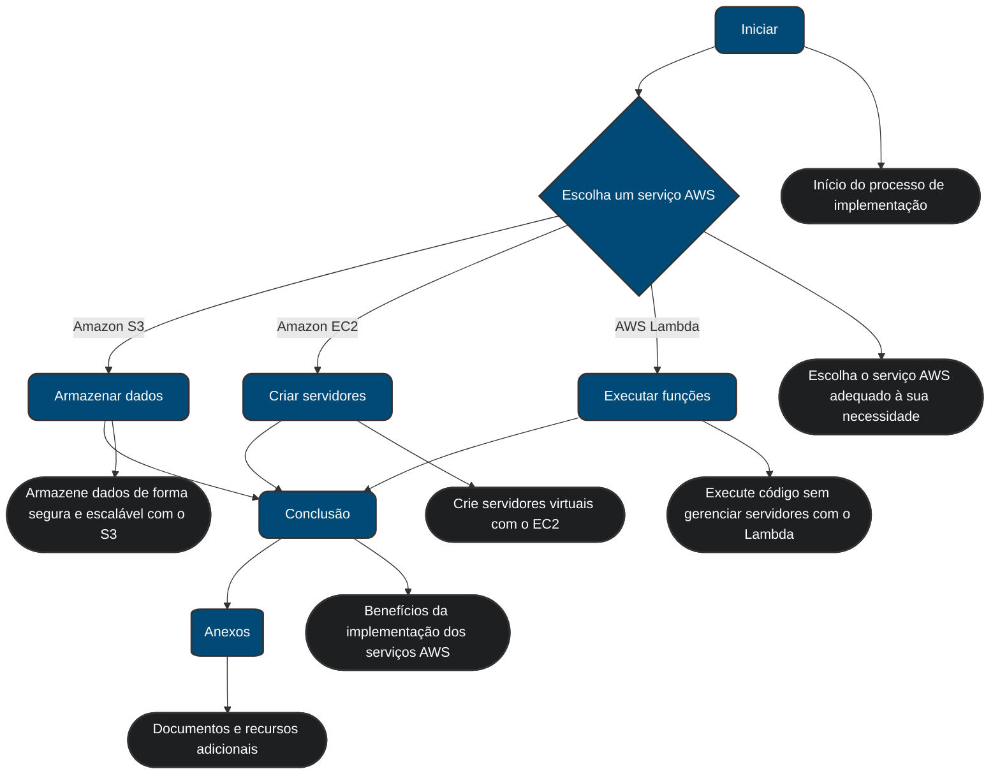

## RELATÓRIO DE IMPLEMENTAÇÃO DE SERVIÇOS AWS

**Data:** 2024-10-02
**Empresa:** Abstergo Industries
**Responsável:** Leonardo Jaques

## Introdução

Este relatório apresenta o processo de implementação de três serviços AWS na empresa Abstergo Industries, realizado por Leonardo Jaques. O objetivo do projeto foi diminuir custos operacionais e otimizar a infraestrutura de TI da empresa.

## Descrição do Projeto

O projeto de implementação dos serviços AWS foi dividido em 3 etapas, cada uma com seus objetivos específicos, visando a redução de custos imediatos. A seguir, serão descritas as etapas do projeto:

### Etapa 1: Migração para Amazon S3

* **Ferramenta:** Amazon Simple Storage Service (S3)
* **Foco:** Armazenamento de dados de baixo custo e alta disponibilidade.
* **Descrição de caso de uso:** Migração do armazenamento de arquivos estáticos da empresa, como imagens, vídeos e documentos, do atual servidor local para o Amazon S3. Isso reduzirá os custos com hardware, manutenção e energia, além de aumentar a disponibilidade e escalabilidade do armazenamento.

### Etapa 2: Otimização de recursos com Amazon EC2

* **Ferramenta:** Amazon Elastic Compute Cloud (EC2)
* **Foco:**  Redução de custos com servidores.
* **Descrição de caso de uso:**  Análise do uso dos servidores atuais e migração para instâncias EC2 otimizadas para as necessidades da Abstergo. Implementação de instâncias com pagamento por uso e redimensionamento automático para ajustar a capacidade de acordo com a demanda, reduzindo custos com servidores ociosos.

### Etapa 3: Implementação do AWS Lambda

* **Ferramenta:** AWS Lambda
* **Foco:**  Redução de custos com execução de código.
* **Descrição de caso de uso:**  Utilizar o AWS Lambda para executar funções e tarefas específicas, como processamento de dados e backups, sem a necessidade de provisionar ou gerenciar servidores. O Lambda permite pagar apenas pelo tempo de computação utilizado, eliminando gastos com servidores dedicados para essas tarefas.

## Visão grafica

## Conclusão

A implementação dos serviços AWS na Abstergo Industries gerou os seguintes benefícios:

* **Redução de custos:** Diminuição dos gastos com hardware, energia, manutenção e servidores ociosos.
* **Aumento da eficiência:** Otimização do uso de recursos e automação de tarefas.
* **Escalabilidade e disponibilidade:**  Possibilidade de ajustar a infraestrutura de acordo com a demanda e garantir alta disponibilidade dos serviços.

Recomenda-se a continuidade da utilização dos serviços AWS implementados e a exploração de novas ferramentas e recursos da plataforma para otimizar ainda mais os processos da empresa.

## Anexos

* Manual de implementação do Amazon S3
* Relatório de otimização de instâncias EC2
* Documentação da implementação do AWS Lambda
* Planilha de comparação de custos

**Assinatura do Responsável pelo Projeto:**

Leonardo Jaques
